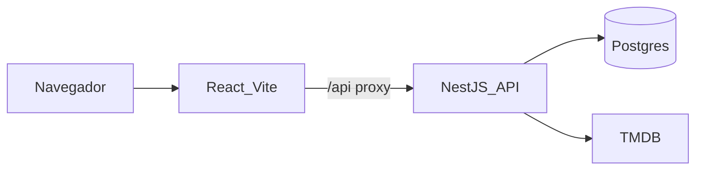
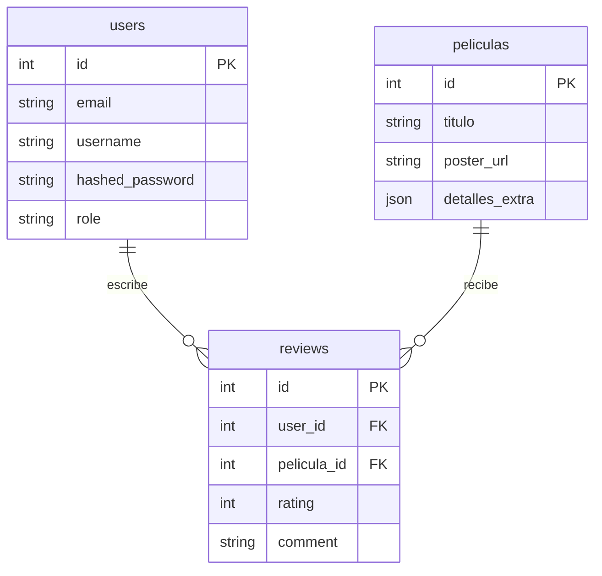
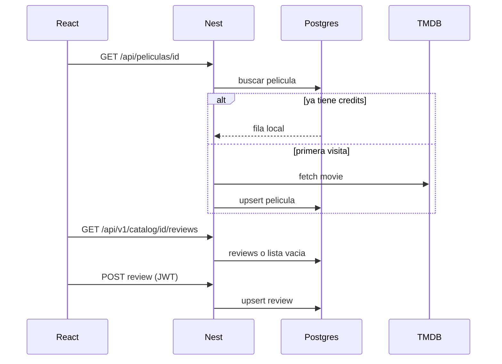

# FOROPELIS — material de presentación

Apoyo visual para explicar temática, solución y arquitectura. No es el código: es el relato de la entrega.

## 1. Temática

FOROPELIS es un foro de cine y series. El usuario explora el catálogo (TMDB), abre una ficha y deja una reseña con puntaje. La comunidad ve las más comentadas y las mejor valoradas; las métricas de actividad quedan para el administrador.

Problema: el catálogo cambia todo el tiempo y no tiene sentido copiar TMDB entero. Solución: TMDB es la fuente del listado; Postgres solo guarda lo que el foro necesita (cuentas, copias de fichas visitadas y reseñas).

## 2. Stack inscrito

| Capa | Tecnología | Rol |
| --- | --- | --- |
| Frontend | React 19 + Vite 7 + Tailwind 4 | UI, rutas, proxy `/api` |
| Backend | NestJS 11 + Prisma + JWT | Auth, catálogo local, proxy TMDB |
| Base | PostgreSQL 16 (Docker) | `users`, `peliculas`, `reviews` |
| Externa | TMDB API | Búsqueda, home, géneros, tráilers |

## 3. Arquitectura

- El frontend no habla con TMDB. Todo pasa por Nest.
- Compose levanta `db` + `api`. Vite queda en el host (`npm run dev`).

## 4. Modelo de datos

- `peliculas.id` es el id de TMDB, no un id interno.
- Una reseña por usuario y película (`uq_review_user_item`).
- `peliculas` no es el catálogo completo: es caché + ancla de FK.

## 5. Flujo de una ficha

El listado (home, tendencias, búsqueda) no escribe en Postgres. La película entra a la base **cuando alguien abre la ficha**.

## 6. Cómo se corre y cómo se valida

1. `docker compose up -d --build` → API en `:3001` y Postgres en `:5432`.
2. `cd frontend && npm run dev` → UI en `:5173`.
3. CI (GitHub Actions): `npm run test:cov` en backend (falla si el coverage baja de 60%) y `npm run build` en frontend.

## 7. Demo sugerida (5 minutos)

1. Home y una fila del catálogo.
2. Abrir una ficha nueva (primera importación) y recargar.
3. Registrarse / iniciar sesión.
4. Escribir una reseña y verla en la ficha.
5. Más comentadas (y métricas si entras como administrador).
6. Mostrar `docker compose ps` y el badge/log de CI.
